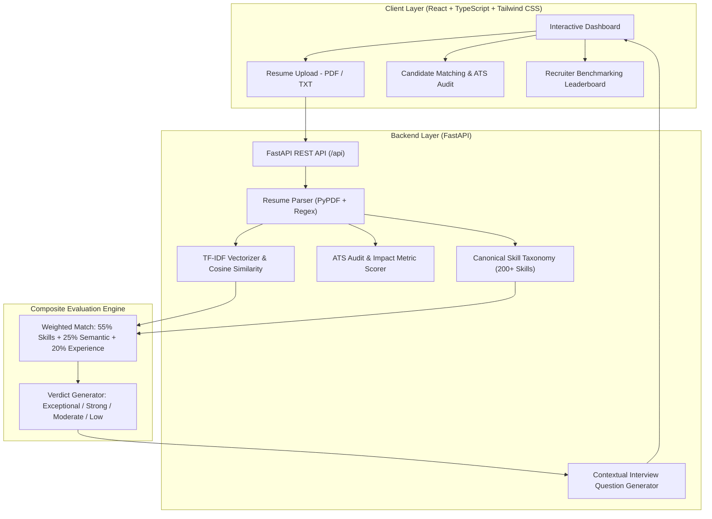

# TalentPulse AI

[](https://github.com)
[](https://python.org)
[](https://fastapi.tiangolo.com)
[](https://react.dev)
[-brightgreen.svg)](https://pytest.org)
[](https://docker.com)
[](LICENSE)

An intelligent Applicant Tracking System (ATS) and resume match intelligence platform. TalentPulse AI analyzes resumes against job descriptions to provide real-time ATS compatibility scoring, skills gap breakdown, and structured interview question guides.

---

## 🏗️ Architecture



---

## ✨ Features

- **Multi-Format Resume Parsing**: Ingests resumes from raw text and `.pdf` files. Extracts contact details (email, phone, LinkedIn, GitHub), work duration, degrees, and classified skills.
- **Hybrid Matching Engine**: Combines canonical skill taxonomy intersection (55%), TF-IDF semantic relevance (25%), and experience calibration (20%).
- **ATS Compliance Audit**: Evaluates resumes on quantifiable metrics (%, \$, scale), power action verbs, standard section structure, and content density.
- **Skills Gap Visualization**: Categorizes skills into Matched Competencies, Missing Core Requirements, Missing Preferred Skills, and Candidate Bonus Skills.
- **Contextual Interview Generator**: Generates technical probes targeting identified skill gaps, along with behavioral questions paired with structured STAR-method rubrics.
- **Recruiter Talent Pool Benchmarking**: Evaluates and ranks multiple candidate profiles against a single job description, with CSV export capabilities.

---

## 🔬 Technical Details

### Skill Extraction Engine
Token-level boundary regex patterns disambiguate multi-meaning terms (such as the programming language "Go" vs. the English verb "go") across 200+ technical, cloud, data, and methodology competencies.

### Vector Scoring
Calculates cosine similarity over unigram and bigram TF-IDF vectors with sublinear term-frequency scaling, calibrated to account for vocabulary divergence between resumes and job postings.

### ATS Rule Engine
Evaluates measurable achievements across:
- Metric density: `r"\b\d+(?:\.\d+)?%"` and `r"\$\s*\d+(?:[.,]\d+)?\s*(?:k|m|b)?\b"`
- Scale indicators: `r"\b\d+(?:\.\d+)?\s*[kKmMbB]?\+?\s+users\b"`
- Active verb frequency vs. passive filler phrasing

---

## ⚡ Quick Start

### Option 1: Docker Compose (Recommended)

```bash
# Clone the repository
git clone https://github.com/yourusername/talentpulse-ai.git
cd talentpulse-ai

# Start all services
docker-compose up --build
```

- **Frontend**: [http://localhost:3000](http://localhost:3000)
- **API Documentation**: [http://localhost:8000/docs](http://localhost:8000/docs)

---

### Option 2: Local Setup

#### Prerequisites
- **Python 3.11+**
- **Node.js 20+** / npm

#### 1. Backend
```bash
# Install dependencies
pip install -r backend/requirements.txt

# Run test suite
pytest backend/tests/ -v

# Start FastAPI server
uvicorn backend.app.main:app --reload --port 8000
```

#### 2. Frontend
```bash
# In a separate terminal
cd frontend
npm install
npm run dev
```

Open [http://localhost:5173](http://localhost:5173) in your browser.

---

## 🧪 Test Suite

All parsing, scoring, and API contracts are validated using Pytest:

```bash
pytest backend/tests/ -v
```

```text
backend/tests/test_api.py::test_health_check PASSED                      [  6%]
backend/tests/test_api.py::test_get_jobs PASSED                          [ 13%]
backend/tests/test_api.py::test_get_sample_resumes PASSED                [ 20%]
backend/tests/test_api.py::test_parse_resume_raw_text PASSED             [ 26%]
backend/tests/test_api.py::test_match_endpoint PASSED                    [ 33%]
backend/tests/test_api.py::test_recruiter_rank_endpoint PASSED           [ 40%]
backend/tests/test_matcher.py::test_compare_skill_sets PASSED            [ 46%]
backend/tests/test_matcher.py::test_calculate_semantic_similarity PASSED [ 53%]
backend/tests/test_matcher.py::test_ats_compliance_scoring PASSED        [ 60%]
backend/tests/test_matcher.py::test_match_resume_to_job_end_to_end PASSED [ 66%]
backend/tests/test_parser.py::test_parse_contact_info PASSED             [ 73%]
backend/tests/test_parser.py::test_detect_sections PASSED                [ 80%]
backend/tests/test_parser.py::test_estimate_experience PASSED            [ 86%]
backend/tests/test_parser.py::test_skill_extraction PASSED               [ 93%]
backend/tests/test_parser.py::test_full_parse_resume PASSED              [100%]

======================== 15 passed in 1.46s ========================
```

---

## 📡 API Reference

| Method | Endpoint | Description |
| :--- | :--- | :--- |
| `GET` | `/api/health` | Service health status and capabilities |
| `GET` | `/api/jobs` | Retrieve available job profiles |
| `GET` | `/api/sample-resumes` | Retrieve sample candidate profiles |
| `POST` | `/api/parse-resume` | Parse PDF or text resume into structured data |
| `POST` | `/api/ats-audit` | Run standalone ATS hygiene evaluation |
| `POST` | `/api/match` | Match resume against job profile |
| `POST` | `/api/recruiter/rank` | Rank candidates against a selected position |

Interactive OpenAPI documentation is available at `/docs` (Swagger UI) and `/redoc`.

---

## 📁 Repository Structure

```
talentpulse-ai/
├── .github/
│   └── workflows/
│       └── ci.yml                 # CI testing pipeline
├── backend/
│   ├── app/
│   │   ├── schemas/
│   │   │   └── models.py          # Pydantic data models
│   │   ├── services/
│   │   │   ├── parser.py          # Resume parsing & extraction
│   │   │   ├── skill_extractor.py # Canonical taxonomy
│   │   │   ├── ats_scorer.py      # ATS audit engine
│   │   │   ├── matcher.py         # Hybrid match algorithm
│   │   │   └── interview_generator.py # STAR question generator
│   │   ├── sample_data.py         # Sample candidates & job profiles
│   │   └── main.py                # FastAPI endpoints
│   ├── tests/                     # Pytest suite
│   ├── requirements.txt
│   └── Dockerfile
├── frontend/
│   ├── src/
│   │   ├── components/            # UI components
│   │   ├── types.ts
│   │   ├── api.ts
│   │   ├── App.tsx
│   │   └── main.tsx
│   ├── package.json
│   └── Dockerfile
├── sample_data/                   # Sample resume and job files
├── docker-compose.yml
├── pytest.ini
├── .gitignore
└── README.md
```

---

## 📄 License
This project is licensed under the [MIT License](LICENSE).
